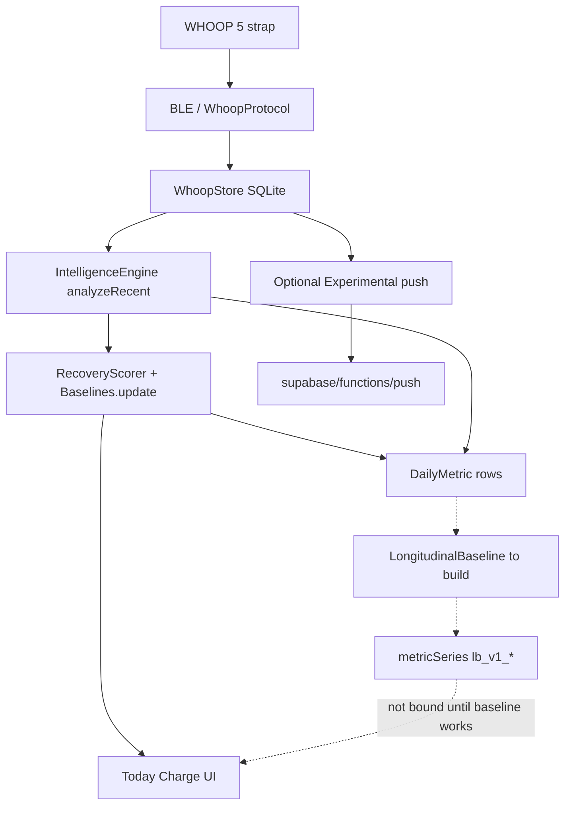

# Longitudinal baseline — how to build on FRWHOOP_v2

This is the **implementation map**. It is not the math spec.

**Start from git HEAD.** There is no longitudinal baseline engine in the tree. An earlier same-day Swift/Kotlin draft and `IntelligenceEngine` shadow calls were removed. Charge, `Baselines.update`, `RecoveryScorer`, `DailyMetric`, and the rest of StrandAnalytics are the existing product. Build the new engine beside them.

## Where this plan lives

There is **no Node API**. On-device analytics (the “backend” for scoring) is `Packages/StrandAnalytics`. Hosted `supabase/` only receives optional Experimental push.

The overall baseline plan sits in **its own folder next to that analytics package**:

`Packages/StrandAnalytics/Baseline/`

| File | Role |
|---|---|
| `FRWHOOP_BASELINE_IMPLEMENTATION.md` | This map |
| `FRWHOOP_BASELINE_FRONTEND.md` | NARA Baseline tab + treatment marking (phase C) |
| `FRWHOOP_BASELINE_CONDENSED_PLAN.md` | Contract: formulas, param_set v1, trial items 1–6, names |
| `FRWHOOP_BASELINE_ONE_CALCULATION.md` | Walkthrough |
| `FRWHOOP_BASELINE_FIELD_METHODS.md` | Methods appendix |
| `FRWHOOP_BASELINE_FINAL_PLAN.md` | Source evaluation |

The same documents are also in `docs/` (`docs/FRWHOOP_BASELINE_*.md`) so the docs tree stays complete. Fork layout: `docs/SCOPE.md`.

When you add code, **do not** fork `Baselines.swift`. New files:

- `Packages/StrandAnalytics/Sources/StrandAnalytics/LongitudinalBaseline.swift` (oracle)
- `Packages/StrandAnalytics/Tests/StrandAnalyticsTests/LongitudinalBaselineTests.swift`
- `android/app/src/main/java/com/noop/analytics/LongitudinalBaseline.kt`
- `android/app/src/test/java/com/noop/analytics/LongitudinalBaselineTest.kt`
- Call site after nightly persist: `Strand/Data/IntelligenceEngine.swift` and the Android `IntelligenceEngine.kt`

Keep this `Baseline/` folder for the plan. Do not mix Charge sources into it.

**Do not build NARA UI until backend phases A and B are green.** Phase A = this week + when-well. Phase B = trial freeze. Phase C = NARA layouts (building / monitoring / trial). Details: [FRWHOOP_BASELINE_IMPLEMENTATION.md](FRWHOOP_BASELINE_IMPLEMENTATION.md) §8–9.

---

## 1. Environment — how the pieces connect

Nothing here runs in strap firmware. Nothing **requires** Supabase. The phone or Mac already has the samples and already scores nights.



| Layer | Path | Role |
|---|---|---|
| BLE decode | `Packages/WhoopProtocol` | Samples into local store. Not the baseline. |
| Local DB | `Packages/WhoopStore` | SQLite: raw streams, `dailyMetric`, `metricSeries`. |
| Nightly scoring | `Strand/Data/IntelligenceEngine.swift`, Android twin | `analyzeRecent` writes `DailyMetric` and Charge. **Does not** call a longitudinal engine on git HEAD. |
| Analytics | `Packages/StrandAnalytics` | Pure functions. Charge lives in `Baselines.swift` + `RecoveryScorer.swift`. |
| Plan | `Packages/StrandAnalytics/Baseline/` | This work’s spec. Mirrored in `docs/`. |
| Apps | `Strand/`, `StrandiOS/`, `android/` | Today shows Charge. |
| Optional push | `Packages/NoopPush`, `supabase/functions/push` | If export is on, `metricSeries` can leave the device. Scoring does not wait. |

**Identity.** Computed nightly rows use the canonical `-noop` device id. Do not mix Apple SDNN into WHOOP RMSSD. Do not mix people.

**As-of.** `T` is the last completed civil day (`newestDay` in `analyzeRecent`). Late samples score a new `T`. They do not edit yesterday’s snapshot.

There is **no HTTP baseline API**. Callers will be in-process.

## 1.1 What “an API” means here (not a web server)

When the plan says API, it means a **stable, documented function contract** in `StrandAnalytics`, the same idea as `Baselines.update` and `RecoveryScorer`: named inputs, named outputs, tests, Swift and Kotlin twins. It does **not** mean a new REST service, a Node scorer, or math in strap firmware.

The WHOOP 5 strap only records and offloads. The phone (or Mac) already owns storage and scoring. FRWHOOP_v2 deleted the Node backend; `supabase/functions/push` is optional backup of rows the phone already computed. A caregiver phone, a later screen, or `noop-local-access` should **call or read** that contract — they should not re-implement the median.

Three layers, only one is “the baseline API”:

| Layer | What it is | Baseline? |
|---|---|---|
| BLE / WhoopProtocol | Bytes from the strap | No. Already exists. |
| Nightly orchestrator | `IntelligenceEngine.analyzeRecent` | Calls the API after `DailyMetric` exists. Does not contain the formulas. |
| Baseline API | `LongitudinalBaseline.evaluate` (to build) | **Yes.** Pure: daily numbers in, snapshot out. |

Optional later **readers** of stored snapshots (UI, MCP `metric_series`, Experimental push) are not a second scorer. If someone later wants HTTPS for a clinician portal, that is a read of `lb_v1_*` (or a thin query over SQLite), not where usual / z / confidence are calculated.

Contract to implement (same on iOS/Mac and Android):

```
observations(days, series) → [daily value + quality_status + quality_reason]
evaluate(asOf T, series, observations) → today, this week’s usual, when-well usual,
    bands, z, gap, p_change, confidence_pct_7, confidence_pct_long, persistence, carry
shadowPoints(asOf T, days) → metricSeries keys lb_v1_{series}_{field}
```

Callers: unit tests on synthetic fixtures first (phase A), then `IntelligenceEngine` once per completed civil day; trial fields on the same `evaluate` path (phase B); NARA UI only in phase C. Not a different HTTP route.

---

## 2. How a night is already scored (what you build beside)

This is git HEAD today.

1. Strap offloads HR / RR / motion / SpO₂ into `WhoopStore`.
2. `IntelligenceEngine.analyzeRecent()` writes a wide `DailyMetric`: `restingHr`, `avgHrv` (RMSSD), `skinTempC`, `respRateBpm`, `spo2Pct`, `steps`, `recovery`.
3. **Charge** uses infinite-horizon Winsorized `Baselines.update` inside `RecoveryScorer`. That 0–100 is Today. Do not feed longitudinal z into it.
4. Other sidecars (Fitness Age, Vitality, steps estimate) already write `metricSeries` under their own keys. Add `lb_v1_*` the same way, after `DailyMetric` persist, imported rows winning per civil day.

Ignore the old “server cache” comment on `DailyMetric` in `MetricsCache.swift`. IntelligenceEngine is the writer.

---

## 3. In-process API to implement

Not present on git HEAD. Target surface:

```
DailyMetric[]  →  observations(series)  →  [LBDailyObservation]
[LBDailyObservation] + asOf T          →  evaluate(...)  →  LBEvaluation
DailyMetric[] + asOf T                 →  shadowPoints     →  [MetricPoint]
```

| Function | Job |
|---|---|
| `observations(from:series:)` | One series from `DailyMetric`. Stub series return `[]`. Missing stays missing. True zero steps with a live stream is a real 0. Every non-OK day carries `quality_status` + `quality_reason`. |
| `evaluate(asOf:series:observations:carry:replay:)` | Score civil day `T`. Default `replay` walks the tape so CUSUM and hold are online. Returns both copies, gap, `p_change`, persistence, **confidence_pct_7 / confidence_pct_long**. |
| `shadowPoints(asOf:days:)` | Wired series: observe → evaluate → `lb_v1_{series}_{field}`. Never write `recovery`. |

Persistence natural key: `(deviceId, day, key)`. Re-running `analyzeRecent` for the same `T` overwrites that day’s shadow.

**Twin rule.** Change Swift first, pin tests, copy assertions into Kotlin.

```bash
cd Packages/StrandAnalytics && swift test --filter LongitudinalBaselineTests
```

---

## 4. What “the baseline works” means (gate before UI)

All of the following, on wired series, with tests. Not a screen.

1. **Two copies, never averaged.** This week = 7-day EWMA on `[T−7, T−1]`. When-well = median on `[T−60, T−8]`. Today `T` is compared to both and is not in either training window.
2. **Student-t + hold.** Abnormal nights downweight `center_7`; if `n_learn < 4`, hold last published `center_7`. Always store `center_7_raw` and gap.
3. **MAD spread, floors, CUSUM `p_change`, persistence, show/established/stale** as in condensed §1.
4. **Confidence this week** and **Confidence when-well** as **percentages 0–100** (condensed §1.7). Not Charge.
5. **Every day that is not quality-OK has a reason.** `quality_status` = `ok` | `low_quality` | `missing`. Low-quality readings may keep a native value in the log but **do not train**. Missing is never 0 bpm.
6. **Charge path isolated.** No write to `DailyMetric.recovery`.

Until (4) and (5) are in `evaluate` + shadow + tests, phase A is **not** done. Do not start NARA UI. Do not start phase B freeze until phase A is green.

---

## 5. Confidence percentage (must ship with the live copies)

Internal booleans (`show_7`, `established_long`, `conf_spread`) stay for gates. The log (and later both people) use a percent.

```
quality_frac = n_ok / max(n_ok + n_low_quality, 1)

confidence_pct_7    = round(100 × valid_7 × coverage_7 × quality_7 × stability_7)
confidence_pct_long = round(100 × valid_long × coverage_long × quality_long × stability_long)
```

| Factor | This week | When-well |
|---|---|---|
| valid | `min(n_7 / 4, 1)` | `min(n_long / 14, 1)` (21 if waking_load, awake_active, or continuous) |
| coverage | `n_7 / 7` | `n_long / 53` |
| quality | quality_frac on `[T−7, T−1]` | quality_frac on `[T−60, T−8]` |
| stability | 0 if stale; else 1 if conf_spread; else 0.70 if long borrow; else 0.45 | 0 if stale; else 0.70 if held for regime; else 1 |

Clip to `[0, 100]`. Pins: full quality week → **100**; four good 7-day nights with borrow → **40**; stale → **0**.

Shadow as `lb_v1_{series}_confidence_pct_7` and `_confidence_pct_long`. Do not mix series into one percent.

---

## 6. Quality reason on every weak reading

Low-quality data is **marked with why**, not silently dropped.

Each civil day in the 61-day tape for a series:

| status | Train? | Store |
|---|---|---|
| `ok` | yes if in a window | value, no reason |
| `low_quality` | no | value if known, **required** reason |
| `missing` | no | no value, **required** reason |

Reasons: `poor_signal`, `low_coverage`, `out_of_range`, `sparse_sleep`, `charging`, `device_off`, `app_fail`, `hospital`, `unknown`.

Map from data already on the phone where it exists (range gates, sparse sleep flags). Do not invent `hospital` from HR. Null `restingHr` with no other cause → `unknown` until a better code exists.

---

## 7. Fact check: condensed methods vs git HEAD

**None of the condensed-plan longitudinal engine is in code.** What *is* in git is Charge’s Winsorized EWMA (`Baselines.update`) and nightly `DailyMetric` columns. Those are a different EWMA and must stay.

| Method | On git HEAD? |
|---|---|
| Windows `[T−7, T−1]` and `[T−60, T−8]` | Specified only |
| Finite 7-day EWMA `α = 0.25` | Specified only (Charge uses another EWMA) |
| Gapped long median + `1.4826 × MAD` | Specified only |
| Student-t `λ`, hold, `center_7_raw`, gap | Specified only |
| CUSUM `p_change` | Specified only |
| `confidence_pct_*` | Specified only |
| `quality_status` + `quality_reason` on every weak day | Specified only |
| Trial freeze / Usual before / Usual since treatment | Specified only |
| Charge isolated | **Yes** — do not change it |

Wired daily *inputs* already exist as columns: sleep RHR, RMSSD, temp, resp, SpO₂ mean, steps. Not yet mapped into this engine. Still missing as daily numbers: awake-rest / awake-active / continuous means, SpO₂ nadir, active minutes.

---

## 8. Build order

Three product phases. Do not start NARA UI until backend phases A and B are green on tests. Do not start trial freeze until both copies of the usual exist and are tested.


Every phase uses the **same series list**. First prove each series on a **synthetic tape** (CSV in `Packages/StrandAnalytics/Baseline/fixtures/`). Then, after `IntelligenceEngine` wiring, replay the same API on **real WHOOP 5** `DailyMetric` rows. The API does not change between fake and strap data.

### Series under test (all phases)

Do not mix rows across this table. A series with no daily column yet is still tested from a fixture; it is not shown in NARA until the column exists.

| Series | Context | DailyMetric today | Fixture id |
|---|---|---|---|
| Sleep resting HR | sleep | `restingHr` | `sleep_rhr` |
| Sleep HRV ln(RMSSD) | sleep | `avgHrv` | `sleep_hrv_ln` |
| Sleep wrist temperature | sleep | `skinTempC` | `sleep_temp` |
| Sleep respiration | sleep | `respRateBpm` | `sleep_resp` |
| Sleep SpO₂ mean | sleep | `spo2Pct` | `sleep_spo2_mean` |
| Sleep SpO₂ nadir | sleep | none yet | `sleep_spo2_nadir` |
| Awake-rest HR | awake_rest | none yet | `awake_rest_hr` |
| Awake-rest HRV | awake_rest | none yet | `awake_rest_hrv_ln` |
| Awake-rest SpO₂ | awake_rest | none yet | `awake_rest_spo2_mean` |
| Awake-active HR | awake_active | none yet | `awake_active_hr` |
| Awake-active HRV | awake_active | none yet | `awake_active_hrv_ln` |
| Awake-active SpO₂ | awake_active | none yet | `awake_active_spo2_mean` |
| Continuous HR | continuous | none yet | `continuous_hr` |
| Continuous HRV | continuous | none yet | `continuous_hrv_ln` |
| Continuous SpO₂ | continuous | none yet | `continuous_spo2_mean` |
| Daily steps | waking_load | `steps` | `waking_steps` |
| Daily active minutes | waking_load | none yet | `waking_active_min` |

Charge / Recovery is **not** a series here. Still/moving is a **minute gate**, not a row.

---

### Phase A — Backend: establish this week and when-well

**Goal.** One in-process API returns **both** copies for one series on day `T`, never averaged. No treatment events. No NARA screens.

**Ship**

1. `LongitudinalBaseline` types + `evaluate` (Swift oracle, then Kotlin twin).
2. Windows: 7-day EWMA on `[T−7, T−1]`; long median on `[T−60, T−8]`; `T` in neither.
3. Student-t, hold, `center_7_raw`, gap, MAD floors, CUSUM `p_change`, persistence, show / established / stale.
4. `confidence_pct_7` and `confidence_pct_long`.
5. `quality_status` + `quality_reason` on every non-OK day.
6. `observations` from `DailyMetric` where the column exists; fixtures for every series including stubs.
7. `shadowPoints` from `IntelligenceEngine` after nightly persist. Never write `recovery`.
8. Daily numbers still missing as columns (awake-rest, awake-active, continuous, SpO₂ nadir, active minutes) stay fixture-tested until those columns exist; do not block phase A on them.

**Exit gate (tests, not UI)**

- Condensed §5 worked numbers on `sleep_rhr` (weights 0.051…0.289, mixed week, all-72 hold, CUSUM 7 vs 14 days).
- Confidence pins: full week **100**, four-night borrow **40**, stale **0**.
- Each fixture series: `evaluate` returns a 7-day snapshot and a long snapshot (or honest “building” when `n` is too small).
- Low-quality and missing days do not train and are not 0.
- HRV math on ln, display ms; steps 0 with a live stream is valid.
- Shadow keys exist for wired series; Charge unchanged.

**NARA:** no new views.

---

### Phase B — Backend: trial freeze and prior vs current

**Goal.** After an explicit treatment start (stored clock time, never inferred from HR), freeze **Usual before treatment** and grow **Usual since treatment**. Compare today to the frozen path. Still no product UI.

**Ship**

1. Event store: start, dose, dose_change, interruption, restart, stop.
2. Qualify before freeze (14 / 21 nights, `n_7 ≥ 4`, not stale, coverage, SpO₂ slots). Thin data → `trial_freeze_ok = 0`.
3. Immutable freeze bundle; new epoch so the long copy after `t0` does not mix pre-start nights.
4. Settling in / on treatment / washing out (7-day clocks). Dose change relabels phase only.
5. Change since start / Change vs old usual, MDC (Bigger than sensor noise?), r1, slope, Why missing, Other things going on, Device or math changed.
6. Same fields for patient and caregiver. No extra caregiver math.

**Exit gate**

- Fixture `sleep_rhr_trial`: pre-start usual 68, post-start 61, freeze stays 68, Change since start matches the condensed trajectory example; `|delta|` vs MDC flag.
- Start with `n_long = 8` → no freeze, adaptive still runs.
- Dose change does not rewrite the freeze.
- Firmware / decoder change after `t0` → provenance break, not a treatment effect.
- Hospital missing day is not 0 bpm and is excluded from the primary contrast.
- Every series in the table has a trial fixture (qualify fail vs qualify pass as appropriate).

**NARA:** still no layout work. Store `trial_id`, phase, and freeze flags so UI can switch later.

---

### Phase C — NARA UI (only after A and B)

NARA is the companion app (`Strand/`, `StrandiOS/`, `android/`). Baseline is a **main feature**. How that tab and treatment marking mount on the existing shell (5 tabs, Meds slot, shared `Strand/Screens`): [FRWHOOP_BASELINE_FRONTEND.md](FRWHOOP_BASELINE_FRONTEND.md). Charge on Today stays the existing 0–100 ring.

Use **existing tokens** (`StrandPalette`, `TypicalRangeBar` hatch, card radii, UPPERCASE tracked labels, big white numbers). No gold. In-range = `statusPositive`, off = `statusWarning`, far off or device/math break = `statusCritical`. Text is white/grey. Patient and caregiver see the **same** screens; captions may shorten.

The page **changes shape** from the same snapshot. There is no separate “testing layout” in the product.

| Shape | When | What is on screen |
|---|---|---|
| Building | `n_7 < 4` and/or long not showable | Today + tracking calendar + Confidence % + Why this reading is weak. Charts show dots only; no fake band. Verdict rail says **Building**, not In range. |
| Monitoring | copies can show, no qualifying start | Two equal graphs (this week / when-well) + calendar + confidence + Off / Days in a row / Has usual changed? |
| Trial | qualifying `t0` | Same two graphs stay (live usual). **Plus** a freeze pair: Usual before / Usual since, Change since start, Bigger than sensor noise?, phase. Start day marked on the calendar. |

#### Confidence (always visible)

Every series header shows **both** percents, not a single blended score:

`CONFIDENCE    THIS WEEK 40%    WHEN-WELL 80%`

Render as two short bars on `track`, fill `statusPositive` when ≥70, `statusWarning` when 40–69, `textTertiary` when building. If confidence is low, **do not** shout Off: dim the verdict to “Not enough nights” and keep the chart. This is not Charge.

#### Tracking calendar (how the tape works)

One 61-slot strip under the header, oldest left → Today right. Same language as the math, no engine names.

```
when-well (53 nights)              this week (7)  today
●●●○●●●●●●●●●●●●●●●●●●●●●●●●●●●●●●●  ●●●○●●●        ★
T−60                          T−8  T−7         T−1  T
```

| Slot | Fill |
|---|---|
| Quality-OK | solid `textPrimary` or `statusPositive` at ~40% opacity |
| Low quality | `statusWarning` hatch (same hatch language as typical-range bars) |
| Missing | empty `track` circle; tap = Why missing |
| Today | thicker ring; not inside either usual |
| Trial start | `accent` tick on that civil day |

Caption, `textSecondary`, one line: “Today is scored against last week and against when-well. It is not folded in yet.” Tapping a slot shows that day’s value or reason. This is how tracking works, not a medication diary (phase is a chip, not a second calendar).

#### First-pass series graph (equal weight, verdict on the sides)

Each biometric is **its own card** (`surfaceRaised`, ~16–20px radius, no border). Do not mix RHR and HRV on one plot.

Two plots **share height, width, padding, type size, and stroke.** Neither is a thumbnail under the other. Stacked on phone; still equal.

```
┌─ SLEEP RESTING HR ──────────────────────────────── 72 bpm ─┐
│ CONFIDENCE   THIS WEEK ████░░ 40%   WHEN-WELL ████████ 80% │
│ [ tracking calendar 61 slots ]                             │
├─────────────┬──────────────────────────┬───────────────────┤
│  IN RANGE   │                          │  61 bpm           │
│  this week  │   7-day plot             │  THIS WEEK’S      │
│  +11 bpm    │   hatch = this week’s    │  USUAL            │
│             │   range                  │  40% confidence   │
├─────────────┼──────────────────────────┼───────────────────┤
│  OFF        │                          │  60 bpm           │
│  when-well  │   when-well plot         │  WHEN-WELL        │
│  +12 bpm    │   hatch = when-well      │  USUAL            │
│             │   range                  │  80% confidence   │
└─────────────┴──────────────────────────┴───────────────────┘
```

**Center (the plot)**

- X = civil days in that copy’s window only (7-day plot is 7 slots; when-well plot is the 53-slot tape, same y-scale).
- White line/dots = daily quality-OK values (`textPrimary`).
- Missing / low-quality = gap or warning hatch, not a zero.
- Horizontal hatch band = that copy’s expected range (`center ± 2 × spread`), same “solid = you, hatch = usual” rule as `TypicalRangeBar`.
- Today is a larger dot **after** the window (7-day plot’s last training night is T−1).
- No z on the axis. Y is bpm / ms / °C / % / steps.
- After a trial start: a vertical `accent` rule at t0 on the when-well plot; frozen usual is a **second** hatch in `textTertiary` (does not replace the live hatch).

**Left rail (interpretation — unique to this copy)**

Not a legend dump. One stacked verdict:

1. UPPERCASE status: **IN RANGE** / **OFF** / **BUILDING** / **WEAK SIGNAL**
2. Which copy: “this week” or “when-well”
3. Signed delta in units: “+12 bpm” (RHR high = elevated; HRV low = suppressed, say “−17 ms”)
4. If Days in a row off ≥ 2 on the when-well row, a second line: “2 nights in a row”

Color the rail from the verdict (green / amber / red). **IN RANGE** is the clear “like usual” read; **OFF** is the clear “not like usual” read. Caption in `textTertiary`: “Not a diagnosis.”

**Right rail (the usual itself)**

Big white **center** + unit. UPPERCASE name of that copy. Confidence bar repeated small so the two plots stay symmetric. Tappable `›` opens a detail sheet (Has usual changed?, Week vs when-well, reasons).

The two rails are the same width so the plots stay equal. Do not put interpretation only under the long plot.

#### Trial shape (same card, extra block)

When `trial_freeze_ok = 1`, insert **below** the two equal plots, same card chrome:

- Phase chip: Settling in / On treatment / Washing out (`accent` outline).
- Two numbers, equal columns: **Usual before treatment** | **Usual since treatment** (or Building).
- One line: **Change since start** in units + **Bigger than sensor noise?** yes/no in status color.
- If Device or math changed: critical banner; do not color Change since start as if it were physiology.
- Other things going on as grey chips, not a modal.

The monitoring plots do not shrink to make room; the page grows. That is the dynamic layout.

#### Navigation

- Series list: UPPERCASE metric name, Today value, tiny dual verdict dots (week / when-well), chevron — same pattern as My Dashboard rows.
- Order: sleep RHR, HRV, temp, resp, SpO₂ mean, then motion, then awake-rest when those columns exist. Hide stub series rather than empty charts.
- Date stepper like Today (`‹ DAY ›`), scored day = last completed civil day.

#### Developer-only tests (not a product mode)

Do **not** ship a “sample data / testing mode” toggle on the Baseline feature. Fixtures never appear as a patient.

| Who | Where |
|---|---|
| Unit tests | `LongitudinalBaselineTests` / Kotlin twin + `fixtures/` CSV |
| UI snapshots | `#if DEBUG` SwiftUI previews and XCTest snapshots injecting snapshots |
| You (developer) | Existing **Test Centre** (Settings → Test Centre), `#if DEBUG` only: inject a baseline fixture to preview building / monitoring / trial. Release builds omit that row |

Caregiver and patient never see fixture injection.

**Exit gate**

- Previews/snapshots for building, monitoring (in range + off), and trial shapes; both plots equal height in the snapshot.
- Confidence bars visible on every series card.
- Calendar strip present; missing day shows a reason, not 0.
- Start event switches monitoring → trial without rescoring Charge.
- Release build has no fixture toggle on the Baseline feature.
- Real WHOOP nights read `lb_v1_*` from phases A–B.

---

### After C

State-space successor is a new version string. Watchdog pages only if `alert_eligible` and Days in a row off agree. If paging is ever added, it uses the same In range / Off language, not a new color system.

---

## 9. How biometrics are tested (every phase)

Two tapes, one API.

**Synthetic (required to merge a phase).** CSV under `Packages/StrandAnalytics/Baseline/fixtures/`:

```
day,value,quality_status,quality_reason,coverage
2026-03-01,60,ok,,
2026-03-02,,missing,device_off,
2026-03-03,200,low_quality,out_of_range,
```

`evaluate` reads this list, not BLE. Golden expected JSON (center_7, center_long, z, confidence_pct, trial fields in phase B) sits next to each CSV. Swift tests are the oracle; Kotlin asserts the same literals.

Named tapes to add with the engine (phase A) and extend (phase B):

| Tape | Proves |
|---|---|
| `sleep_rhr_week_ramp` | 7-day EWMA weights and band |
| `sleep_rhr_fever_hold` | Student-t + hold vs when-well |
| `sleep_rhr_cusum` | Has usual changed? 7 vs 14 days |
| `sleep_hrv_ln_ms` | ln math, ms band |
| `sleep_temp` / `sleep_resp` / `sleep_spo2_mean` | floors and range gates |
| `waking_steps_zero` | 0 steps valid; missing stream not 0 |
| `quality_mix` | reasons, confidence 100 / 40 / 0 |
| `sleep_rhr_trial` (phase B) | freeze 68 vs later 61 |
| stubs for nadir / awake-rest / active minutes | API accepts empty or fixture-only series |

**Real WHOOP 5 (after IntelligenceEngine shadow).** Query `DailyMetric` for the wired columns, run the same `evaluate(asOf:)`. Compare to fixtures only for shape (confidence present, reasons present), not for matching 61.1 bpm. A night with `stagingSparse` must come through as `sparse_sleep` / `poor_signal`, not as a silent drop.

Phase C UI tests inject fixture snapshots in **DEBUG / Test Centre only**. Live strap is the last check, not the first. Release NARA has no sample-patient mode.

---

When in doubt, the condensed plan in this folder is the contract. Git HEAD is the product you attach to. This file is the order of work.
