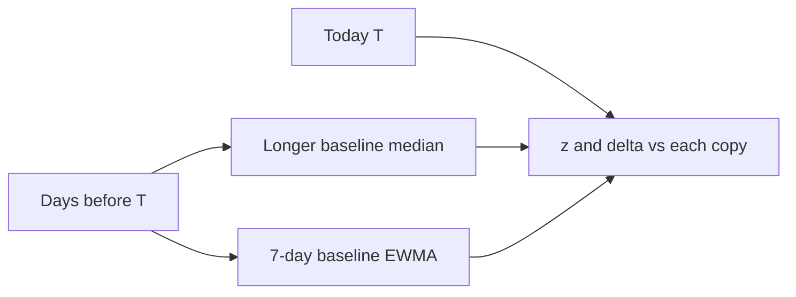
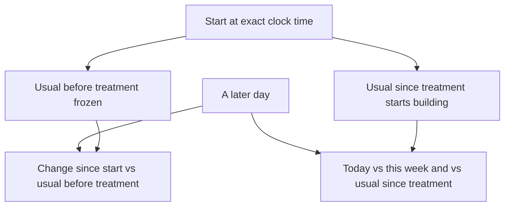

# One calculation: both baselines, then a treatment period

This note is a walkthrough, not the spec. The contract is [`FRWHOOP_BASELINE_CONDENSED_PLAN.md`](FRWHOOP_BASELINE_CONDENSED_PLAN.md). How to build on git HEAD (no engine in tree yet): [`FRWHOOP_BASELINE_IMPLEMENTATION.md`](FRWHOOP_BASELINE_IMPLEMENTATION.md). Plan folder next to analytics: `Packages/StrandAnalytics/Baseline/`. Numbers here match the condensed-plan worked examples (sleep resting heart rate).

Charge and Recovery are a different path. They stay on the existing Winsorized EWMA. Nothing in this note replaces that number or mixes metrics into one 0–100 score.

## What we are trying to say

For one person, one metric, one context (here: **sleep resting HR from WHOOP**), we want two honest sentences every morning:

1. **This week:** what has this person’s last handful of nights been doing, with last night counting more than a night six days back?
2. **When well:** what was usual *before* this week, so a bad week cannot quietly become “normal”?

Those are two snapshots. They are never averaged. Today is compared to each of them. Today itself is **not** folded into either snapshot yet. That day is `T`: the last completed civil day on the device calendar.




If this person later starts a treatment, we **copy** those snapshots at the start time and freeze the copy. Live snapshots keep updating. The frozen copy does not. That is how a real drop (68 → 61) is not learned away.

## How the two timelines sit on the calendar

Think of a **61-day tape** ending at `T`. One slot is today. Seven slots are “this week.” Fifty-three slots are “when well.” They never share a night.

```
oldest                                                                 newest
|← 53 days, longer median →|← 7-day EWMA →|T|
T−60                    T−8  T−7       T−1 T
```


| Slice       | Calendar days | Count | Job                                                |
| ----------- | ------------- | ----- | -------------------------------------------------- |
| Longer copy | `[T−60, T−8]` | 53    | When well (median). Equal rank; no recency.        |
| 7-day copy  | `[T−7, T−1]`  | 7     | This week (EWMA). Last night counts most.          |
| Today       | `T` only      | 1     | Scored against both copies. **Not folded in yet.** |


“60-day” is the lookback *start* (60 days before `T`). It is not 60 included days. Inclusive math: `(T−8) − (T−60) + 1 = 53`.

The two copies are **not** “wait 60 days, then also look at 7 days.” They run in parallel on different ages of the same series. A night is in at most one copy at a time.

### Life of one night D


| When `T` is        | Where night D sits                                                                          |
| ------------------ | ------------------------------------------------------------------------------------------- |
| `T = D`            | Today. Weight 0 on both copies.                                                             |
| `T = D+1` … `D+7`  | 7-day EWMA only. Heaviest the next morning (age 0), lightest just before it leaves (age 6). |
| `T = D+8` … `D+60` | Longer median only. One equal vote among up to 53 nights.                                   |
| `T ≥ D+61`         | Aged out. Gone from both.                                                                   |


Each morning `T` ticks forward by one civil day: yesterday becomes last night (age 0 in the EWMA); every other 7-day age increases by 1; the night that was `T−7` **leaves** the EWMA and **enters** the longer median; the night that was `T−60` drops off the far end.

That is why the long copy cannot use this week: those seven nights have not aged into `[T−60, T−8]` yet. The gap is a waiting period of eight days from “this was last night” to “this may vote on when well.”

## How long before a baseline can actually be calculated

The engine can run from the first stored night. It does **not** wait for a full 53-day long window. Empty slots are missing, not zeros. What changes with time is whether we are allowed to **show** a number, call it **established**, or **freeze** it for a trial.

Counts are quality-OK nights *in that copy’s window*, not “days since the person bought the strap.” Four good nights with three gaps still count as four. A missed week delays the long copy because those nights never enter the 53-day list.

Assume every night is quality-OK, and night `D` is the first completed civil day. Then `T` is the morning we score.


| Clock                            | 7-day EWMA                                                                                       | Longer median (RHR / HRV / temp / resp / SpO₂)                                                                                                     | Steps / active minutes                            |
| -------------------------------- | ------------------------------------------------------------------------------------------------ | -------------------------------------------------------------------------------------------------------------------------------------------------- | ------------------------------------------------- |
| First night (`T = D`)            | Nothing to train on. `T` is held out.                                                            | Empty. A night cannot enter until it is 8 days old.                                                                                                | Same.                                             |
| After **4** nights (`T = D+4`)   | **First showable** 7-day snapshot (`n_7 ≥ 4`). Provisional. Spread is jumpy. Not alert-eligible. | Still empty or almost empty (nothing has reached `T−8` yet).                                                                                       | Same.                                             |
| After **7** nights (`T = D+7`)   | Full week in the EWMA. Still **no** long copy: `T−8` is the day before `D`.                      | Still waiting.                                                                                                                                     | Same.                                             |
| After **8** nights (`T = D+8`)   | Rolling 7-day continues (`D+1`…`D+7`).                                                           | **First night** `D` enters the longer list. `n_long = 1`. Not shown.                                                                               | Same.                                             |
| After **11** nights (`T = D+11`) | Rolling 7-day.                                                                                   | **First showable** long snapshot (`n_long ≥ 4`: nights `D`…`D+3`). Calibrating / provisional.                                                      | Same.                                             |
| After **21** nights (`T = D+21`) | Rolling 7-day. Student-t downweight **turns on** once long is established.                       | **Established** (`n_long ≥ 14`: nights `D`…`D+13`). This is the “when well” we trust enough to downweight the week and to consider a trial freeze. | Still provisional (`need 21` in the long window). |
| After **28** nights (`T = D+28`) | Unchanged rule.                                                                                  | Established (and still filling toward 53).                                                                                                         | **Established** (`n_long ≥ 21`).                  |
| After **61** nights (`T = D+61`) | Unchanged: always only the last 7 before `T`.                                                    | Window is **full** (53 slots). Night `D` ages out. Older history no longer affects the median.                                                     | Same full window.                                 |


Minimum calendar time, if they wear every night:

- **~5 days** from first wear to a *provisional* 7-day number (four completed nights, then a morning `T` that is not one of those four).
- **~12 days** to a *provisional* longer number (those four nights must then age 8 days into the gap).
- **~3 weeks** to an *established* when-well copy for sleep / rest series (14 long nights).
- **~4 weeks** for steps / active minutes (21 long nights).
- **~2 months** before the long window is completely full. Full is not required to calculate; it is only when the oldest night starts falling off.

Until the long copy is established, `λ = 1` for every quality-OK night: the 7-day EWMA trains at full weight. That is expected on a new strap. We do not pretend we already know “when well.”

**Stale:** if this series has no quality-OK night for more than **14** consecutive calendar days, the live snapshots are stale. They are not used as a trial freeze, and they should not be treated as a current usual.

**Trial freeze** needs more than “we have a number.” On the morning before `t0` this metric must have an established long copy, a showable 7-day copy, not be stale, and not be in an unaccepted regime. In practice that is **at least those ~3 weeks** of good nights for RHR (longer for motion), often more if nights were missing. `n_long = 8` is not enough; adaptive still runs; we do not invent a control.

The walkthrough below is a morning *after* that setup: the longer copy is already established near 60 bpm. That is why Student-t can downweight the 72s. On day 6 of a new wearer, that part of the story would not run yet.

## The two statistical tools, in plain language

**Median** (longer copy). Sort the numbers and pick the middle. One or several high nights do not drag the middle the way an average would. That is why “when well” uses a median: a fever week should not become the new usual just because it aged into the lookback.

**EWMA** (7-day copy). Exponentially weighted moving average: a weighted mean where each older night is multiplied by the same shrink factor. Span 7 uses `α = 2/(7+1) = 0.25`, so last night is about 29% of a full week and the oldest of the seven is about 5%. A median of seven nights would ignore recency until the 4th sorted value flips. The EWMA does not.

**MAD, then × 1.4826** (spread on both copies). Spread is how jumpy this person usually is. Standard deviation squares residuals, so one glitch inflates the scale. MAD is the median of absolute distances from that copy’s center. For roughly bell-shaped data, `1.4826 × MAD` is a σ-like scale (NIST). We then floor it (2 bpm for sleep RHR) so a perfectly flat week cannot make every tiny bump look huge.

**z-score.** `(today − center) / spread`. About how many “personal sigmas” today sits from that copy. The band is `center ± 2 × spread` (`k_band = 2` in v1). A z of 3.8 is “far from this copy.” It is not an alert by itself.

**Student-t weight λ.** After the longer copy is established, a night that is already off *that* slower usual should not fully train the 7-day center. We do not drop it to zero. We scale its EWMA weight by `λ = min(1, 5 / (4 + z_long²))`. `|z| = 0 → λ = 1`. `|z| = 4.2 → λ ≈ 0.23`. Moderate nights still teach a little; extremes almost do not.

Missing days are missing. They are never entered as zero (except a true zero step count with a live stream).

## One person, one morning

Sleep resting HR, bpm. `T` is today. The seven nights before today, oldest → newest:

`57, 58, 59, 60, 61, 62, 63`

Today `T = 72`.

The longer lookback (explained next) is already established near **60 bpm**, with spread **2.85 bpm**. That is the “when well” scale we will use for downweight and for z vs the slow copy. On a new wearer this would not be true until ~21 quality nights had aged into the long window (see the clock above).

We always build the **longer copy first**, then the 7-day copy.

## Longer baseline (secondary): gapped 60-day median

**Window.** Calendar days `[T−60, T−8]`, inclusive. That is **53 days**, not 60. “60-day” is the lookback *start*. The same seven days that feed the EWMA have weight 0 here. `T` also has weight 0. This gap is deliberate: this week cannot vote on “when well.”

For this walkthrough the well nights in that window sit around 60. After trim (below), we take:

- `center_long` = median of the kept nights = **60 bpm**
- `MAD_long` ≈ 1.92, `1.4826 × 1.92 = 2.85` → `spread_long = 2.85` (above the 2 bpm floor)
- band = 60 ± 2×2.85 = **54.3 to 65.7 bpm**

**Show / established.** At least 4 kept nights in `[T−60, T−8]` to show a number. At least **14** to call it established (`n_long_waking = 21` for steps/active minutes, awake-active, and continuous). Those nights must have aged at least 8 days; you cannot fill the long copy from this week. Until it is established, the 7-day copy does not downweight against it (`λ = 1` for every quality-OK night).

**Trim.** Before the median, drop nights that are already `|z| ≥ 2` vs a first-pass median, but only if enough of the list remains (keep at least 65% and at least 4 nights). Seven fever nights at 72 in a list of 46 well nights at 60: the median of all 53 is still 60; the 72s are trimmed; `center_long` stays 60.

**CUSUM (regime probability).** Trim stops a *minority* of bad nights from walking the median. A genuine new state is a running probability, not “14 days then relabel.” Each new long-window night adds `|today − center| / spread − 0.5` to a score `S` (floored at 0). Then `p_change = 1 − exp(−S / 20)`. If `p_change ≥ 0.90`, we **hold** the last established long center. We do not call 72 the new usual.

- Seven fever days at `|z| ≈ 4.2`: `S ≈ 26`, `p_change ≈ 0.73` → trim, no new usual.
- Fourteen such days: `S ≈ 52`, `p_change ≈ 0.93` → hold.

Today vs this copy:

```
z_long = (72 − 60) / 2.85 = 4.2
```

That is the “when well” score. A later watchdog would read this first. This pass only stores it.

## 7-day baseline (primary): span-7 EWMA

**Window.** `[T−7, T−1]`. Tonight (`T`) is not in it. Last night is age 0.

Raw weights, if the night is quality-OK:

`w_raw = 0.25 × 0.75^age`

On a full week, after we make the seven weights sum to 1 (oldest → newest):


| Day | Value | Age | Share of a full week |
| --- | ----- | --- | -------------------- |
| T−7 | 57    | 6   | 0.051                |
| T−6 | 58    | 5   | 0.069                |
| T−5 | 59    | 4   | 0.091                |
| T−4 | 60    | 3   | 0.122                |
| T−3 | 61    | 2   | 0.162                |
| T−2 | 62    | 1   | 0.216                |
| T−1 | 63    | 0   | 0.289                |


**center_7** = weighted sum = **61.1 bpm**.

Last night (63) pulls the center up from the middle of the week. A median of these seven would be 60.

**Spread.** Distances from 61.1: `4.1, 3.1, 2.1, 1.1, 0.1, 0.9, 1.9`. Median of those (MAD) ≈ 1.92. `1.4826 × 1.92 = 2.85`. Floor is 2, so spread stays **2.85**. Band = 61.1 ± 5.70 = **55.4 to 66.8 bpm**.

Today 72:

```
delta_7 = 72 − 61.1 = 10.9 bpm
z_7     = 10.9 / 2.85 = 3.8
```

Need **4** quality-OK nights in the week to show this number. Four nights are not enough to treat spread or a later alert as strong.

If a night is missing, its raw weight is 0. The others are scaled so they still sum to 1. We do not dump the missing night’s mass onto last night only.

## When this week is mixed: Student-t, not a binary freeze

Same long usual: 60 / 2.85, established. Week is `58, 59, 60, 61, 62, 72, 72`. Today is 72 again.

The two 72s have `z_long = 4.2`, so `λ ≈ 0.23`. The other five nights have `λ = 1`.

- `n_learn = 5 + 2×0.23 = 5.46` (this is a *sum of λ*, not a headcount)
- 5.46 ≥ 4, so the 7-day *training* center **does** update
- `center_7_raw` (full EWMA, no λ) = **66.3** — “what this week looked like”
- `center_7` (EWMA with λ) = **62.7** — “what we allow to become this week’s usual”
- `gap = 66.3 − 60 = 6.3` bpm. Gap is the explicit fast–slow difference.

Spread this week is a mix until `n_learn` reaches 7: about 78% this week’s MAD and 22% the long spread → `spread_7 ≈ 3.79`.

Today vs the downweighted center: `z_7 = (72 − 62.7) / 3.79 = 2.5`. Vs the long copy: `z_long = 4.2`. A small 7-day z is not “back to normal” while gap and `z_long` are still large.

If **all seven** nights are 72, each `λ ≈ 0.23`, `n_learn ≈ 1.6 < 4`. We **hold** the last good `center_7` (61.1). `center_7_raw` is still 72 so the absorbed week is visible. The training center does not become 72.


## Names on the screen (same list for patient and caregiver)

Engine fields stay in the log for tests. **What people see** uses the names below. Patient and caregiver get **the same metrics** on every series. The caregiver does not get a private extra set. Captions can be shorter for the patient; nothing is hidden.

**Nothing in this table is on NARA Today today.** The app still shows Charge (0–100), Effort, sleep, and the raw daily numbers (RHR, HRV, …). These names appear only in phase C, after the backend writes snapshots. Until then the log may store them; the home screen does not.

Lead with **Today** in real units (bpm, ms, °C, %, steps). Then one sentence in those same units. Do not put “z = 4.2” on the card. z is how we decide in/out of range (`|z| ≥ 2` → outside that copy’s band).

### Always on (monitoring), once a copy can show

| Name they see | Simple meaning | Example on sleep resting HR |
|---|---|---|
| **Today** | Last finished day’s number | 72 bpm |
| **This week’s usual** / **this week’s range** | What the last handful of nights have been doing (last night counts more) | 61 bpm, about 55–67 |
| **Off this week** | Is today unlike *this week*? | 11 bpm above this week; outside this week’s range |
| **Longer usual** / **longer range** | Slow usual from earlier nights (this week cannot vote). Not a diagnosis of “well.” | 60 bpm, about 54–66 |
| **Off longer usual** | Is today unlike that slower usual? | 12 bpm above longer usual |
| **Week vs longer usual** | Did *the whole week* drift away from the slower usual? | This week’s look is 6 bpm higher |
| **Days in a row off** | One odd night vs a run | 2 nights in a row outside longer usual |
| **Has usual changed?** | Might the slow usual itself have moved? Not a medication start | Unlikely / possible / likely |
| **Confidence this week** / **Confidence longer** | How complete and stable that usual is (not Charge) | 40% this week; 80% longer |
| **Why this reading is weak** / **Why missing** | If today is unusable or missing, say why. Never show 0 bpm for a hole | Strap off; poor signal; charging; hospital |

**How to read Off this week vs Off longer usual.** A fever week can look “normal for this week” while still far from longer usual. That pair is the honest story. A lone Off longer usual is not an alert.

After a treatment is marked, the frozen slow copy is labeled **Non-treatment usual** (it does not take on-treatment nights). The live slow copy is **On-treatment usual**, titled with the treatment name from the form (example: “On lisinopril usual”). See the frontend outline.

Sign in words, not jargon: RHR **higher** = elevated; HRV **lower** = suppressed; steps **lower** = less motion than usual.

### Extra rows after a recorded treatment start (trial layout)

The screen **changes shape**. Same people, same series, extra comparison. Not a claim that the drug caused the change.

| Name they see | Simple meaning | Example |
|---|---|---|
| **Non-treatment usual** | Frozen slow usual from *before* the start time. On-treatment nights do not rewrite it | 68 bpm |
| **On-treatment usual** | Slow usual from nights *after* start, labeled with the treatment name | Building, then ~61 bpm |
| **Change since start** | Today vs the path they were already on (includes slow drift before start). Main trial line | About 8 bpm lower than that path |
| **Change vs old usual** | Today vs the frozen average, ignoring that they might already have been drifting | 7 bpm lower than 68 |
| **Bigger than sensor noise?** | Is that shift bigger than night-to-night strap/algorithm jitter? | Yes |
| **Sensor noise** / **body variation** | Jitter from the sensor vs real day-to-day body scatter. Detail, not the headline | Sensor ~1 bpm; body the rest |
| **Night-to-night hangover** / **effective nights** | Last night still affects tonight, so 40 nights are not 40 independent tests. Detail | Hangover present; fewer effective nights |
| **Settling in** / **on treatment** / **washing out** | Effect is not assumed instant (about a week in, a week out) | On treatment |
| **Other things going on** | Illness, hospital, travel, bad sleep, extra meds — so a shift is not read in a vacuum | None / travel |
| **What device and math** / **Device or math changed** | Which strap and which formula. A firmware change is not a treatment effect | Device or math changed: yes |

Engine names (`z_long`, `gap`, `p_change`, …) stay in tests and `lb_v1_*` keys. They are not card titles.

### What NARA shows right now vs after phase C

| Now (git HEAD) | After phase C |
|---|---|
| Charge 0–100, Effort, sleep stages, daily RHR/HRV as raw numbers | Those stay |
| No “longer usual”, no freeze, no Change since start | New Baseline feature: building → monitoring → trial; non-treatment usual after a start |

Do not replace Charge with Off longer usual. They are different math.


## What a treatment period does

The daily math does not change. After an explicit start (stored clock time, never inferred from HR), we keep **Usual before treatment** frozen and grow **Usual since treatment** on a new epoch. Patient and caregiver both see that pair, plus the shared list above.



Call Change since start **physiological change since intervention**. It is not a causal drug claim.

### 1. Do not freeze whatever is on the phone that morning

Each series must **qualify** on the as-of **strictly before** start. If it fails, that series has no Usual before treatment (`trial_freeze_ok = 0`). This week’s usual still updates. We do not invent a control from three thin nights.

Minimum v1 gates (different series may need longer):

- When-well established: **14** quality nights in the long window for sleep/rest series; **21** for steps and active minutes
- This week’s usual showable: **4** of the last 7 nights
- Not stale (a quality night within 14 calendar days)
- Has usual changed? is not already “yes” without an accepted new epoch
- Coverage / quality in section 3 of the condensed plan (awake rest: ≥30 still minutes; awake active: ≥30 moving minutes; continuous HR/HRV: ≥240 valid minutes; SpO₂: ≥8 valid 30-minute slots on at least 10 of the long kept nights)
- Store the baseline period: first and last civil day that entered the freeze

### 2. Sensor noise vs body variation (minimum detectable change)

MAD on the live series mixes both. At freeze, on consecutive quality-OK pairs in the freeze window:

- Night-to-night difference δ → **Sensor noise** `σ_meas = 1.4826 × MAD(δ) / √2`
- **Body variation** `σ_bio² = max(spread² − σ_meas², 0)`
- **Bigger than sensor noise?** `MDC_95 ≈ 2.77 × σ_meas`

If |Change since start| is smaller than that floor, `above_mdc = 0`: we do not treat it as a shift larger than test-retest noise. Both audiences see Today, Change since start, and Bigger than sensor noise? together.

### 3. Exact timing, dose, and phases (not an instant effect)

Store events with **exact timestamps**: start, dose, dose change, interruption, restart, stop. Never infer them from the HR series.

v1 phase clocks (tunable):

- **Settling in** — 7 days after start, restart, or dose change
- **On treatment** — after settling in until a stop, interruption, or another dose change
- **Washing out** — 7 days after stop or interruption

Dose change / stop **relabel the phase**. They do not rewrite Usual before treatment. A restart keeps that freeze unless a new trial id is opened and the series qualifies again.

### 4. Nights hang together; record other things going on

Consecutive nights are correlated. At freeze we store **Night-to-night hangover** (lag-1 autocorrelation of residuals) and **effective nights** `n_eff ≈ n × (1−r1)/(1+r1)`. Change since start also uses the pre-start **slope** so a person already drifting is not scored as if they were flat:

`expected = Usual before treatment + slope × days since freeze`

v1 does not fit a full seasonal model. Weekday/weekend is not split on this pass (weekend steps widen scatter). Underlying trend is the frozen slope. Periodicity is logged as a later param_set, not silently assumed zero.

**Other things going on** (one or more flags on day T): none, illness, hospitalization, travel, sleep disruption, exercise change, concomitant meds. The primary Change since start contrast uses days with Other things going on = none **and** Why missing = none. Other days stay in the **same** log both people can open.

### 5. Missingness is kept, with a cause

A day with no usable value is **missing**, never 0 bpm. **Why missing**: none, poor signal, charging, strap off, app fail, hospital, unknown. Counts of Why missing are part of the trial log. In these patients, missingness itself can be information. Both people see the hole and the cause.

### 6. Freeze full provenance; a device change is not a treatment effect

Frozen with Usual before treatment, and stored on every live snapshot:

device model, firmware, decoder version, metric-definition / algorithm version, sensor source, pointer to the underlying raw samples.

If any of those change after start: **Device or math changed**. Do not treat that step as Change since start.

### Same person, after treatment

Qualify and freeze: Usual before treatment = **68** bpm, scatter 2.85, slope +0.05 bpm/day. Sensor noise = 1.0 bpm → Bigger than sensor noise? threshold ≈ 2.77 bpm.

28 days later, today = **61** bpm, Settling in is over (On treatment), Why missing = none, Other things going on = none, Device or math changed = no.

This week’s usual has been allowed to learn: about **61**. Off this week ≈ 0.

```
expected                 = 68 + 0.05 × 28 = 69.4 bpm
Change vs old usual      = 61 − 68        = −7.0 bpm
Change since start       = 61 − 69.4      = −8.4 bpm
Bigger than sensor noise?  |−8.4| > 2.77  → yes
```

Usual before treatment stays 68. The 61s do not enter it. Usual since treatment is still building until ~14 post-start nights have aged 8 days (both people see “building,” not a fake after-usual).

The product comparison is **Usual before treatment vs Usual since treatment**, plus Change since start. Never average those copies.

## Questions before implementation

### How do we store the data so the long-term baseline can actually be calculated?

The long copy is **not** a separate 60-day blob that must be complete before math can run. It is recomputed each morning from **one number per civil day per series**, already sitting on the phone.

What must exist in local storage:

1. **Raw WHOOP samples** in WhoopStore (HR, RR, motion, SpO₂ slots, steps). The strap writes these over BLE. Nothing in this engine reads the strap directly.
2. **Daily numbers** on `DailyMetric` (and later still-waking / SpO₂-nadir / active-minute columns when those exist): `restingHr`, `avgHrv` (RMSSD), `skinTempC`, `respRateBpm`, `steps`, `spo2Pct` if it is a real %. One row per `(device, yyyy-MM-dd)`. Missing stays null, never 0 (except true zero steps with a live stream).
3. **Enough of those daily rows** in the long window `[T−60, T−8]`. Four quality-OK rows there → we can *show* a long center. Fourteen (twenty-one for motion) → it is *established*. A full 53 is only when the window is packed; it is not a storage prerequisite.

Each morning, `IntelligenceEngine` already upserts `DailyMetric` for scored days. The longitudinal engine (not in git yet) will read that history (imported rows win over computed), score `T`, and write a **shadow** into `metricSeries` under versioned keys such as `lb_v1_sleep_rhr_center_long`. Late-arriving nights create a **new** snapshot for a new `T`. They do not edit yesterday’s row.

If daily RHR was never persisted, there is nothing to median. The long baseline cannot be invented from Charge’s EWMA state.

### What will actually get displayed for the patient and the caregiver?

This pass **stores** snapshots. Screens come later. Charge on Today/Recovery is unchanged. Never show a blended 0–100 from this engine.

**Same metrics for both people.** The naming table above is the shared list. Patient and caregiver see every row for every series. Wording can be shorter for the patient; nothing is caregiver-only.

Shared card (example: sleep resting HR, after the when-well copy is established):

- **Today** — 72 bpm
- **This week’s usual** and **this week’s range** — 61 bpm, 55–67 (or “building” if fewer than 4 nights)
- **Off this week** — how far 72 sits from 61
- **When-well usual** and **when-well range** — 60 bpm, 54–66 (or “building”)
- **Off when-well** — 72 vs 60
- **Week vs when-well** — this week’s look minus when-well
- **Days in a row off** — including 2 of last 3, and whether today is further than yesterday
- **Has usual changed?** — chance when-well itself moved
- **Confidence this week** / **Confidence when-well** — percent; not Charge
- **Why this reading is weak** / **Why missing** — every non-OK day has a reason
- After a qualifying start (same extra rows for both people): **Usual before treatment**, **Usual since treatment** (or “building”), **Change since start**, **Change vs old usual**, **Bigger than sensor noise?**, **Sensor noise** / **body variation**, **Night-to-night hangover** / **effective nights**, **Settling in / on treatment / washing out**, **Why missing**, **Other things going on**, **What device and math** / **Device or math changed**

In range / above / below is the **band** around that copy (`|Off …| < 2` vs `≥ 2`). Sign is metric-specific (RHR: higher = elevated; HRV: lower = suppressed). Per series: do not average Off when-well for RHR with Off when-well for HRV.

HRV shows in **milliseconds**. Wrist temperature is labeled wrist, not core.

### Does a z-score above a threshold mean the baseline is out of range or elevated?

The **baseline** is the center and band. It is not “out of range.” **Today** (or this week) is compared to that band.

v1: expected band = `center ± 2 × spread` (`k_band = 2`). That is about a personal 2σ usual range if spread ≈ σ. It is **not** an alert.

| | Meaning |
|---|---|
| Off this week or Off when-well between −2 and +2 | Inside that copy’s expected band |
| Off this week or Off when-well at or beyond ±2 | Outside that copy’s band — “off this usual,” not a diagnosis |
| Sign | Direction in that metric’s units. Sleep RHR: **positive = elevated** vs that copy. Sleep HRV: **negative = suppressed**. Steps: negative = below usual motion. |

Use **Off when-well** for “off when well.” Use **Off this week** for “off this week.” A small Off this week while Off when-well and Week vs when-well are large means the week has started to look like itself, not that the person is back to when-well.

A later watchdog may page only if the long copy is established, not stale, Has usual changed? is not an unaccepted yes, **and** Days in a row off agrees (2 of last 3, or two-plus days). A single Off when-well never pages. This pass only **stores** those flags.

### What does CUSUM do here?

CUSUM is **not** the 7-day EWMA and **not** the z-score. It watches whether the **slow** usual itself is moving, as nights age into `[T−60, T−8]`.

Each new long-window night: add `|value − current when-well| / scatter − 0.5` to a running score `S` (never below 0). Missing nights skip; they do not reset `S`. Then **Has usual changed?** = `1 − exp(−S / 20)`.

- A few fever nights: trim keeps when-well at 60; Has usual changed? ≈ 0.73 → still the old usual.
- A long run at 72: Has usual changed? ≥ 0.90 → **hold** the last established when-well. Do not quietly relabel 72 as when-well.

Has usual changed? is a **regime probability**. A recorded treatment start is a different event: it freezes Usual before treatment and opens Usual since treatment. Do not use Has usual changed? as a fake start timestamp.

### Won’t Student-t filter out true outliers?

It does **not** delete them from the record, and it does **not** zero their weight.

Student-t only scales how much a night **trains `center_7`**. A true 72 still:

- stays in `center_7_raw` (the week as it looked);
- keeps a large **Off when-well** (4.2 vs when-well 60);
- still moves the 7-day center a little (`λ ≈ 0.23`), not not at all.

If we trained at full weight, seven true fever nights would pull `center_7` to 72 and **today’s 7-day z would collapse** even though the person is still off when-well. That is the failure mode. Downweight protects the training center; the log still shows the 72s.

Impossible values (200 bpm “resting”, SpO₂ 101%) are not observations. Those are range gates, not Student-t.

### Will the longer-term baseline change once treatment starts?

**Two long copies after `t0`:**

| Copy | Name on screen | Does it change after treatment? |
|---|---|---|
| Frozen long snapshot from days strictly before start | **Usual before treatment** | **No.** |
| New long median on nights on or after start (once 8 days old) | **Usual since treatment** | **Yes**, as those nights accumulate. |

Without a new epoch at start, the sliding 53-day window would keep mixing pre-treatment nights into Usual since treatment for up to two months. Setup clocks apply again: ~12 days to *show* Usual since treatment, ~3 weeks of post-start quality nights to *establish* it. Until then both people see “building,” not a fake after-usual. Do not average the two.

This week’s usual after start answers “usual now.” **Change since start** vs Usual before treatment answers physiological change since intervention. Established Usual since treatment vs Usual before treatment answers whether the slow usual itself moved since start.

### What is a good 7-day center? What is an abnormal week?

There is no population “good” (no 60 bpm chart). **Good** means: enough nights to show, and this week is not off the slower usual.

**Showable 7-day center** (`show_7`): `n_7 ≥ 4` quality-OK nights in `[T−7, T−1]`. Provisional. Last update can be `T−1`.

**A 7-day center we allow to update** (the “last good” center we hold when the week is off): `n_learn ≥ 4`. `n_learn` is the sum of Student-t `λ`, not a headcount. If the whole week is 72 vs a when-well of 60, `n_learn ≈ 1.6` → **hold** the previous good `center_7` (61.1 in the example). That held value is the last week that still trained.

**This week looks like when-well:** when-well established, Week vs when-well small, Off when-well on recent nights inside the band.

**Abnormal week** (engineering, not a diagnosis): when-well established, and this week is off that copy — large Off when-well and/or large Week vs when-well, often so this week’s usual is held. **Days in a row off** is how a later watchdog would distinguish one odd night from a week. Direction depends on the metric. Layer 1 does not combine those into one score.


## Request chart (from the condensed-plan prompts)

Drawn from the condensed plan and field methods: personal usual + range; do not learn deterioration; Charge untouched; on-device WHOOP 5; one series at a time; HRV as ln(RMSSD); sleep vs awake-rest vs awake-active vs continuous; freeze at an explicit treatment start; confidence as a percent; every weak reading has a reason; no blended 0–100; no watchdog paging in this pass; call trial contrast physiological change since intervention.

| Request | Where it lives | Status |
|---|---|---|
| Math on the paired phone/computer, not strap firmware, not a required server | Condensed plan intro | Specified; not in git yet |
| WHOOP 5.0 samples; one daily number per series | Condensed §3 | DailyMetric columns exist; engine mapping not in git |
| Separate series; never mix sleep vs awake-rest vs awake-active vs continuous, RMSSD vs SDNN, mean vs nadir, steps vs active minutes | Series key | Specified |
| Charge / Recovery untouched; no blended 0–100 | Every plan | Charge path on git HEAD; do not change it |
| 7-day usual and when-well usual with a 7-day gap | Condensed §1 | Specified; not in evaluate yet |
| Median + MAD; do not learn fever into this week’s training center | Condensed §1.4 | Specified |
| Extremes are evidence | Brief | Specified |
| Preserve missingness and Why missing / Why this reading is weak | Condensed §1.7 | Specified |
| Confidence as a percent (valid days × coverage × quality × stability) | Condensed §1.7 | Specified |
| Qualify before freeze; different metrics, different durations | Boss trial item 1 | Documented; 14 vs 21 nights; SpO₂ slot gate |
| Sensor noise vs body variation; MDC | Boss trial item 2 | Documented; Bigger than sensor noise? |
| Exact start/dose/interrupt/stop; Settling in / on treatment / washing out | Boss trial item 3 | Documented; 7-day phase clocks |
| Autocorrelation, trend, confounders | Boss trial item 4 | Documented; Night-to-night hangover, slope, Other things going on |
| Freeze provenance; Device or math changed ≠ treatment effect | Boss trial item 6 | Documented |
| Usual before treatment and Usual since treatment both visible | This document | New epoch at start |
| Same metrics for patient and caregiver | This document | Shared naming table; UI after baseline works |
| No live pages until baseline works | Implementation map | Confidence % and quality reasons first |
| Shadow, versioned snapshots | Condensed step 7 | Specified; `lb_v1_*` keys not in git |

## What to remember


| Piece | Role |
| --- | --- |
| 61-day tape | 53 long + 7 week + 1 today; a night is in at most one copy |
| Setup | ~4 nights → show 7-day; ~12 days → show long; ~3 weeks → established (sleep); ~4 weeks → established (motion) |
| Full 53-day window | Not required to calculate; only when the oldest night starts falling off |
| 7-day EWMA | This week’s usual; last night counts more |
| Gapped 60-day median | When-well usual; this week cannot vote |
| Student-t λ | Stops an abnormal week from fully becoming the 7-day center |
| Hold when `n_learn < 4` | Whole week off the slow usual → keep last good 7-day center |
| Off when-well / Off this week / Week vs when-well | Shared names for z_long, z_7, gap |
| Days in a row off | Shared name for persistence |
| Has usual changed? | Shared name for CUSUM p_change |
| Confidence this week / when-well | Percent from valid days, coverage, quality, stability |
| Why this reading is weak | Reason on every low-quality or missing day |
| Usual before / Usual since treatment | Frozen prior vs new-epoch after |
| Qualify, MDC, phases, hangover, Why missing, provenance | Six trial requirements; same list for both people |
| Charge | Untouched |


Implementation details, parameter tables, and every metric’s floor live in the condensed plan. This note is only the one-calculation picture.